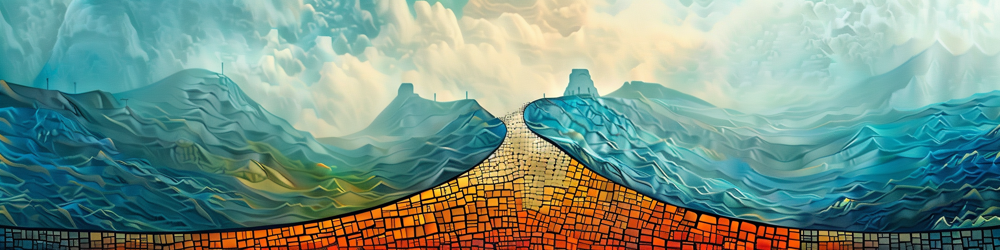

The following people 🙏 have kindly reported typos and errors.  
The errors are ordered by the number of typos found, weighted by severity (text typo, math typo, text error and math error).  
Affiliation of the student is when their latest error was found.

**Bayesian Learning**

-   Alice Jonason, Stockholm University
-   Tea Unnebäck, Stockholm University
-   Sune Karlsson, Örebro University
-   Jinzhe Yang, Stockholm University
-   Joachim Tscherpel, Stockholm University
-   Federico M. Stefanini, University of Milan
-   Dagmar Kallenberg, Stockholm University
-   Mona Sfaxi, Stockholm University
-   Michael Sederlin, KTH Royal Institute of Technology
-   Per Gösta Andersson, Stockholm University
-   Patrik Mirzai
-   Toni Dumitriu, Stockholm University

**Bayesian Learning - the prequel**

-   Joachim Tscherpel, Stockholm University
-   Ganna Fagerberg, Stockholm University

Please email me any typos and errors at my obvious gmail address. Thanks!
